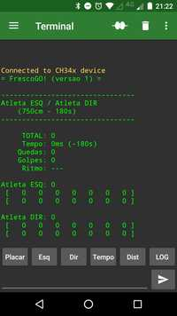
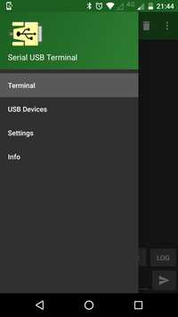
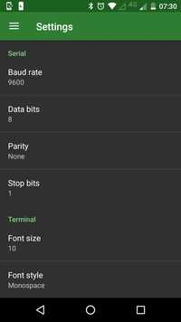
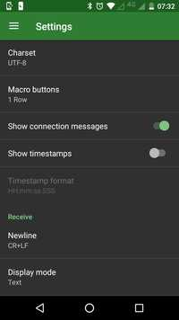
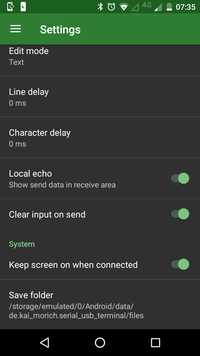

<meta http-equiv="Content-Type" content="text/html; charset=UTF-8"/>

<!--
$ pandoc README.md -H deeplists.tex -o frescogo.pdf
$ pandoc README.md -H deeplists.tex -o frescogo.html
-->

# FrescoGO! (versão 2.0)

*FrescoGO!* é um marcador eletrônico semiautomático para treinamento e
competições de Frescobol.

O aparelho marcador contém dois botões de marcação: um para o atleta à esquerda
e um para o atleta à direita.
A marcação é feita por um juiz, que pressiona o botão correspondente ao atleta
toda vez que ele acerta a bola.
<!--
Golpes de esquerda e direita são distinguidos pelo tempo de pressionamento do
botão.
-->
Com base em uma distância previamente estabelecida e o tempo decorrido entre
dois golpes consecutivos, o aparelho calcula a velocidade média atingida pela
bola a cada troca.
O botão do meio sinaliza início de sequência, queda de bola, fim de
apresentação, etc.
Também há uma entrada USB para visualização do placar e um saída para som para
sinalizar os golpes.


- Links do projeto:
    - Site: <https://github.com/frescogo/frescogo>
    - E-mail: <go.frescobol@gmail.com>
    - Vídeos: <https://www.youtube.com/channel/UCrc_Ds56Bh77CFKXldIU-9g>
    - Licença: <https://creativecommons.org/publicdomain/mark/1.0/deed.pt_BR>

**O projeto eletrônico, o software e a regra são de domínio público, podendo
ser usados, copiados e modificados livremente.**

-------------------------------------------------------------------------------

## Regra para 5:00 minutos

- **Golpes:**
    - Cada atleta é avaliado individualmente pelas médias de velocidade dos
      seguintes quesitos:
        - **Volume:**
            - Média *quadrática* da velocidade de todos os seus golpes.
                - (A média quadrática considera as velocidades elevadas ao
                   quadrado.)
        - **Máximas - Normal:**
            - Média simples da velocidade dos `24` golpes mais fortes efetuados
              pelo seu lado preferencial ("lado normal").
        - **Máximas - Revés:**
            - Média simples da velocidade dos `16` golpes mais fortes efetuados
              pelo seu lado não preferencial ("lado revés").
            - O revés só é válido quando supera em 10% a velocidade do golpe
              anterior do parceiro.
    - O total do atleta é a média ponderada entre os três quesitos:
        - `ATLETA = 60% Volume + 25% Normal + 15% Revés`
- **Equilíbrio:**
    - A pontuação de equilíbrio da dupla é a média entre os totais dos dois
      atletas.
    - Se um atleta estiver abaixo dessa média (com uma margem de 5%), então a
      pontuação de equilíbrio será o menor total:
        - `EQUILIB = MENOR((ATL1+ATL2)/2, MENOR(ATL1,ATL2)x1.05)`
- **Continuidade:**
    - A apresentação é encerrada sumariamente na `20a` queda.
    - Os dois últimos golpes antes de cada queda são sempre desconsiderados.
    - Cada queda subtrai `2%` da pontuação após calcular o equilíbrio da dupla:
        - `FINAL = EQUILIB x (100 - 2x QUEDAS) / 100`

```
  ATLETA  = 60% Volume + 25% Normal + 15% Revés
  EQUILIB = MENOR( (ATLETA1+ATLETA2)/2, MENOR(ATLETA1,ATLETA2)x1.05 )
  FINAL   = EQUILIB x (100 - 2x QUEDAS) / 100
```

## Regra para 2:30 minutos

- **Golpes:**
    - Cada atleta é avaliado individualmente pelas médias de velocidade dos
      seguintes quesitos:
        - **Volume:**
            - Média *quadrática* de velocidade de todos os seus golpes.
                - (A média quadrática considera as velocidades elevadas ao
                   quadrado.)
        - **Máximas - Normal:**
            - Média simples da velocidade dos `12` golpes mais fortes efetuados
              pelo seu lado preferencial ("lado normal").
        - **Máximas - Revés:**
            - Média simples da  velocidade dos `8` golpes mais fortes efetuados
              pelo seu lado não preferencial ("lado revés").
            - O revés só é válido quando supera em 10% a velocidade do golpe
              anterior do parceiro.
    - O total do atleta é a média ponderada entre os três quesitos:
        - `ATLETA = 60% Volume + 25% Normal + 15% Revés`
- **Equilíbrio:**
    - A pontuação de equilíbrio da dupla é a média entre os totais dos dois
      atletas.
    - Se um atleta estiver abaixo dessa média (com uma margem de 5%), então a
      pontuação de equilíbrio será o menor total:
        - `EQUILIB = MENOR((ATL1+ATL2)/2, MENOR(ATL1,ATL2)x1.05)`
- **Continuidade:**
    - A apresentação é encerrada sumariamente na `10a` queda.
    - Os dois últimos golpes antes de cada queda são sempre desconsiderados.
    - Cada queda subtrai `4%` da pontuação após calcular o equilíbrio da dupla:
        - `FINAL = EQUILIB x (100 - 4x QUEDAS) / 100`

```
  ATLETA  = 60% Volume + 25% Normal + 15% Revés
  EQUILIB = MENOR( (ATLETA1+ATLETA2)/2, MENOR(ATLETA1,ATLETA2)x1.05 )
  FINAL   = EQUILIB x (100 - 4x QUEDAS) / 100
```

<!--
- 
      Exemplo:
        - Com 5 quedas, a dupla perderá 10% dos pontos, ou seja, se ela pontuou
          4400 após o equilíbrio, a pontuação final será de **3960 pontos**
          (`4400x90%`).
        - Ex., se os atletas pontuaram 4000 e 5000 pontos, pega-se a média
          (`(5000+4000)/2 = 4500`) e 110% do menor (`4000x110% = 4400`).
          A pontuação de equilíbrio será o menor entre os dois valores
          (`4500 vs 4400`): **4400 pontos**.

Os três quesitos são somados As três médias são 

    - A velocidade de cada golpe efetuado por um atleta é elevada ao quadrado,
      dividida por 100 e somada ao total do atleta. Não há velocidade mínima.
      Exemplos:
        - 30 kmh vale **09 pontos**: `30x30/100 =  900/100 =  9`.
        - 40 kmh vale **16 pontos**: `40x40/100 = 1600/100 = 16`.
        - 50 kmh vale **25 pontos**: `50x50/100 = 2500/100 = 25`.
        - 60 kmh vale **36 pontos**: `60x60/100 = 3600/100 = 36`.
        - 70 kmh vale **49 pontos**: `70x70/100 = 4900/100 = 49`.
        - 80 kmh vale **64 pontos**: `80x80/100 = 6400/100 = 64`.
        - 90 kmh vale **81 pontos**: `90x90/100 = 8100/100 = 81`.
- **Máximas:**
    - A média de pontuação dos `36` golpes mais velozes de cada atleta é
      multiplicada por `72` e somada ao seu total (bônus `x2` por cada golpe).
    - São considerados `24` golpes efetuados pelo lado preferencial do atleta
      ("lado normal") e `12` golpes efetuados pelo lado não preferencial do
      atleta ("lado revés").
    - Exemplo:
        - A média dos `24` golpes mais velozes do lado normal foi de `75 kmh`.
        - A média dos `12` golpes mais velozes do lado revés  foi de `55 kmh`.
        - A média dos `36` golpes mais velozes foi então de `68 kmh` com `46`
          pontos por golpe.
        - Esse atleta vai então obter **3312 pontos** (`46 x 72`) no quesito
          de *Máximas* que ainda serão somados aos seus pontos de *Volume*.
    - OBS.:
        - Tipicamente, golpes pelo lado normal são efetuados de *forehand* e
          golpes pelo lado revés de *backhand*. No entanto, qualquer qualidade
          de golpe é válida, inclusive trocando a raquete de mão.
        - Os `36` golpes dentre as máximas também são considerados no quesito
          **Volume** normalmente.
    - OBS.: Em uma apresentação de 3 minutos, 7 golpes correspondem a
      aproximadamente 10% dos golpes em posição de ataque.
-->

-------------------------------------------------------------------------------

## Fluxo da Apresentação

- Um som agudo longo indica que a uma nova apresentação irá começar.
- Um som agudo indica que o atleta pode sacar.
- Após o saque, o juiz pressiona o botão correspondente a cada atleta toda vez
  que ele acerta a bola. O tempo só passa quando o botão é pressionado.
- Um som identifica a faixa de velocidade do golpe anterior:
    - ` < 40 kmh`: som simples grave
    - ` < 50 kmh`: som simples médio
    - ` < 60 kmh`: som simples agudo
    - ` < 70 kmh`: som duplo   grave
    - ` < 80 kmh`: som duplo   médio
    - ` < 90 kmh`: som duplo   agudo
    - `>= 90 kmh`: som duplo   muito agudo
- Um golpe do lado não preferencial do atleta acompanha um som grave (após o
  som correspondente à velocidade).
- Quando a apresentação está desequilibrada, os ataques do atleta que mais
  pontuou acompanham um som grave.
- Quando a bola cai, o juiz pressiona o botão de queda que emite um som
  característico.
- Os dois últimos golpes são ignorados e o tempo volta ao momento do último
  golpe considerado (i.e., um ataque tem que ser defendido e depois confirmado
  pelo próprio atacante).
- O juiz então pressiona o botão que habilita o saque e o fluxo reinicia.
- Um som agudo é emitido a cada 1 minuto e também quando faltam 30, 10, e 5
  segundos para a apresentação terminar.
- A apresentação termina após 5 minutos cronometrados ou após o limite de
  quedas ou após aproximadamente 650 golpes (por restrições técnicas).
  Um som grave longo indica que a apresentação terminou.
- Ao fim da apresentação, é gerado um relatório com todas as medições de
  golpes.

### Formatação do Resultado

A seguir são explicados os formatos de exibição do resultado da apresentação.

- Placar (a cada sequência)

```
-----------------------------------------------
                  Joao / Maria                            <-- nome dos atletas
-----------------------------------------------

TOTAL .............. 41.73 pts                            <-- total de pontos
Tempo Restante ..... 01:23                                <-- tempo restante
Quedas ............. 10                                   <-- número de quedas
Golpes ............. 440                                  <-- quantidade de golpes
Média .............. 51 kmh                               <-- média geral em km/h
Juiz ............... Arnaldo                              <-- nome do juiz

-----------------------------------------------

      Joao: 50.27 pts (50.70 vol / 63.87 nrm / 20.08 rev) <-- totais do atleta à esquerda
 rev  [ 45 44 40 39 38 35 00 00 00 00 00 00 ... ]         <-- 24 golpes de revés mais fortes
 nrm  [ 75 69 67 65 65 65 65 64 64 64 64 64 ... ]         <-- 24 golpes normais  mais fortes

-----------------------------------------------

     Maria: 54.07 pts (53.39 vol / 64.20 nrm / 38.66 rev) <-- totais do atleta à direita
 rev  [ 48 46 41 40 38 38 36 36 36 35 35 35 ... ]         <-- 24 golpes de revés mais fortes
 nrm  [ 71 71 67 65 65 64 64 64 64 64 64 64 ... ]         <-- 24 golpes normais  mais fortes

-----------------------------------------------

v200/750cm/300s/maxs(85,200)/equ1/cont20/fim20)           <-- configurações
  \-- versão do software
       \-- distância entre os ateltas
            \-- tempo máximo de apresentação
                      \-- velocidade máxima a detectar (85 km/h)
                         \-- sensibilidade do revés (200ms)
                              \-- quesito de equilíbrio (0=desligado, 1=ligado)
                                    \-- desconto por queda (20 = 2.0%)
                                           \-- número máximo de quedas

-----------------------------------------------
```

- Relatório (ao final da apresentação)

```
-- Sequencia  1 ----------------        <-- Início da primeira sequência.
            ****                        <-- Maria efetuou o primeiro golpe.
     800            (33 km/h)           <-- Joao golpeou 800ms depois.
             440    (61 km/h)               A velocidade do primeiro golpe de
     820            (32 km/h)               Maria foi de 33 km/h.
             350    (77 km/h)
     790            (34 km/h)
     ...
             930 !  (29 km/h)           <-- Joao golpeou de esquerda (!).
     550            (49 km/h)           <-- Maria golpeou 550ms depois.
             610    (44 km/h)               A velocidade do golpe anterior de
     820            (32 km/h)               Joao foi de 44 km/h.
             360    (75 km/h)
     700            (38 km/h)
             370
                                        <-- Queda.
-- Sequencia XX ----------------        <-- Outras sequências...
...

-----------------------------------------------

    Atleta   |    Vol     Nrm     Rev    |     Total      <-- Volume, Normal, Revés e Total
      Joao   |   50.70   63.87   20.08   |   50.27 pts    <-- Pontuação de Joao
     Maria   |   53.39   64.20   38.66   |   54.07 pts    <-- Pontuação de Maria

-----------------------------------------------

Media ........... 52.17 pts             <-- Média entre Joao e Maria
Equilibrio ...... 00.00 (-)             <-- Desconto de equilíbrio
Quedas (10) .....   20% (-)             <-- Desconto de quedas
TOTAL ........... 41.73 pts             <-- Pontuação final da dupla
```

-------------------------------------------------------------------------------

## Instruções para o Juiz

### Ligação dos Cabos

- Celular (micro USB) -> Aparelho (mini USB)
    - É necessário um adaptador micro USB para USB
- Aparelho (PS2/AUX) -> Som (PS2/AUX)


### Aparelho marcador:

- Nova apresentação:
    - Pressione o botão do meio e em seguida o da direita por 3 segundos.
    - Resposta: um som médio de dois segundos.
- Início de sequência:
    - Pressione o botão do meio por um segundo, até escutar um som.
    - Resposta: um som agudo de meio segundo.
- Golpes dos atletas:
    - Pressione o botão da esquerda ou direita quando, respectivamente, o
      atleta à esquerda ou à direita golpearem a bola. Se o golpe for um revés
      (lado não preferencial do atleta), o pressionamento deve ser um pouco
      mais demorado.
    - Resposta: depende da velocidade (ver a seção "Fluxo da Apresentação").
- Queda de bola:
    - Pressione o botão do meio por um segundo, até escutar um som.
    - Resposta: três sons cada vez mais graves por meio segundo.
- Fim da apresentação:
    - Automático, quando o tempo do cronômetro expirar. <!-- ou após a 25a queda. -->
    - Resposta: um som grave por dois segundos.
- Desfazer última sequência:
    - Pressione o botão do meio e em seguida o da esquerda por 3 segundos.
    - Resposta: três sons cada vez mais agudos por meio segundo.
- Reconfiguração de fábrica:
    - Pressione o botão do meio e em seguida os da esquerda e direita por
      3 segundos.
    - Resposta: um som médio de dois segundos.
    - **Em princípio, esse procedimento nunca deverá ser necessário.**

### Aplicativo Android

- Instalação (apenas uma vez):
    - Instalar o app `Serial USB Terminal` (by Kai Morich).
        - <https://play.google.com/store/apps/details?id=de.kai_morich.serial_usb_terminal>

- Configuração (apenas uma vez):
    - Tocar nas três barras paralelas no canto superior esquerdo e selecionar
      `Settings`.
    - Trocar `Baud rate` para `9600`.
    - Trocar `Font size` para `10`.
    - Trocar `Font style` para `Monospace`.
    - Desabilitar `Show timestamps`.
    - Trocar `Buffer size` para `Unlimited`.
    - Habilitar `Clear input on send`.
    - Habilitar `Keep screen on when connected`.









- Conexão (sempre que abrir o aplicativo):
    - Conectar o aparelho ao celular via cabo USB.
    - Tocar no ícone com dois cabos desconectados no centro superior direito da
      tela.
        - O ícone deve mudar para um com cabos conectados.
        - A área central do app deve exibir `Connected to...` e o placar da
          última apresentação.

<!--
    - O placar da última apresentação deve ser exibido no centro da tela.
    - A cada queda e reinício, é exibido o placar da apresentação em andamento.
-->

- Comandos (durante as apresentações):
    - Digitar o comando completo na área de texto na base inferior e em seguida
      tocar no ícone com uma seta no canto inferior direito.
    - Exibição:
        - `placar`
            - exibe o placar da apresentação
        - `relatorio`
            - exibe o relatório completo da apresentação
    - Ação:
        - `reiniciar`
            - reinicia a apresentação imediatamente
        - `terminar`
            - termina a apresentação imediatamente
        - `desfazer`
            - desconsidera por inteiro a sequência anterior
        - `restaurar`
            - restaura a configuração de fábrica
    - Configuração da Apresentação:
        - `tempo SEGS`
            - altera o tempo total das apresentações para `SEGS`, que deve ser
              um número em segundos
            - Exemplo:
                - `tempo 180`
                - altera o tempo de apresentação para 3 minutos
        - `distancia CMS`
            - altera a distância das apresentações para `CMS`, que deve ser um
              número em centímetros
            - Exemplo:
                - `distancia 800`
                - altera a distância para 8 metros

<!--
        - `maximas SIM/NAO`
            - liga ou desliga a pontuação de máximas (`nao=desligada`, `sim=ligada`)
            - Exemplo:
                - `maximas sim`
                - habilita a pontuação de máximas
-->

        - `maxima VEL`
            - altera a velocidade máxima a ser considerada para `VEL`, que deve
              ser um número em kmh (bolas acima de `VEL` serão consideradas
              como `VEL`)
            - Exemplo:
                - `maxima 90`
                - bolas acima de 90 kmh serão interpretadas como 90 kmh
        - `reves MS`
            - altera o tempo mínimo para detectar um revés para `MS`, que deve
              ser um número em milisegundos
            - caso o valor seja `0`, os golpes de revés serão desconsiderados
            - Exemplo:
                - `reves 200`
                - altera a sensibilidade do revés para 200 milisegundos
        - `equilibrio SIM/NAO`
            - liga ou desliga a pontuação de equlíbrio (`nao=desligada`, `sim=ligada`)
            - Exemplo:
                - `equilibrio nao`
                - desabilita a pontuação de equilibrio
        - `esquerda NOME`
            - altera o nome do atleta à esquerda para `NOME`, que deve ter até
              15 caracteres
            - Exemplo:
                - `esquerda Maria`
                - altera o nome do atleta à esquerda para *Maria*
        - `direita NOME`
            - altera o nome do atleta à direita para `NOME`, que deve ter até
              15 caracteres
            - Exemplo:
                - `direita Joao`
                - altera o nome do atleta à direita para *Joao*
    - Configuração do Aparelho:
        - `juiz NOME`
            - altera o nome do juiz para `NOME`, que deve ter até 15 caracteres
            - Exemplo:
                - `juiz Arnaldo`
                - altera o nome do juiz para *Arnaldo*
        - `modo MODO`
            - altera o modo de exibição para `MODO`, que deve ser `cel` ou `pc`
            - Exemplo:
                - `modo pc`
                - altera o modo de exibição para `pc`

- Envio de relatórios:
    <a name="envio-de-relatorios"></a>
    - No aplicativo `Serial USB Terminal`:
        - Aguarde o término da apresentação
        - Aperte na lata de lixo no canto superior direito para apagar a tela
        - Digite `relatorio`
            - Aguarde o término da operação
        - Aperte nos 3 pontinhos no canto superior direito
            - Selecione `Save Data`
                - Vai aparecer uma mensagem tal como `Saved serial_20190602_160522.txt`
    - No `WhatsApp`:
        - Selecione o contato a enviar o relatório
        - Aperte no clipe para anexar um arquivo
            - Selecione `Documento`
        - Aperte em `Procurar outros documentos...`
        - Aperte nos 3 pontinhos no canto superior direito
            - Selecione `Mostrar armazenamento interno`
                - (Esse procedimento só é necessário uma vez)
        - Aperte nas 3 barrinhas no canto superior esquerdo
            - Selecione o modelo do seu celular, ex.: `Moto E(4)`
            - Selecione `Android`
            - Selecione `data`
            - Selecione `de.kai_morich.serial_usb_terminal`
            - Selecione `files`
            - Selecione o arquivo a ser anexado, ex.:  `serial_20190602_160522.txt`
            - Selecione `Enviar`
                - Confirme

<!--
        - `continuidade PCT`
            - altera o percentual de perda por queda de bola para `PCT`, que
              deve ser um número
-->

-------------------------------------------------------------------------------

## Perguntas e Respostas

- Qual é o objetivo desse projeto?
    - Oferecer uma maneira objetiva, simples e barata de avaliar apresentações
      de frescobol.
    - Estar disponível no maior número de arenas de frescobol que for possível.
    - Auxiliar no desenvolvimento técnico de atletas, estimular a formação de
      novos atletas e contribuir para o crescimento do Frescobol de competição.

- Como eu consigo um aparelho desses?
    - Entre em contato conosco por e-mail:
        - <go.frescobol@gmail.com>

- Esse aparelho é um radar? Como o aparelho mede a velocidade da bola?
    - O aparelho não é um radar e mede a velocidade de maneira aproximada:
        - Os atletas devem estar a uma distância fixa predeterminada.
        - O juiz deve pressionar o botão no momento exato dos golpes (ou o mais
          próximo possível).
        - O aparelho divide a distância pelo tempo entre dois golpes
          consecutivos para calcular a velocidade.
        - Exemplo: se os atletas estão a 8 metros de distância e em um momento
          a bola leva 1 segundo para se deslocar entre os dois, então a
          velocidade foi de 8m/s (29 kmh).

- Quais as desvantagens em relação ao radar?
    - A principal desvantagem é que a medição não é tão precisa pois os atletas
      se movimentam e o juiz inevitavelmente irá atrasar ou adiantar as
      medições.
    - OBS.:
      O radar também não é perfeito, tendo erro estimado entre +1/-2 kmh.
      Além disso, qualquer angulação entre a trajetória da bola e a posição do
      radar afeta negativamente as medições (ex., um ângulo de 25 graus diminui
      as medições em 10%).
        - Fonte: <https://www.stalkerradar.com/stalker-speed-sensor/faq/stalker-speed-sensor-FAQ.shtml>

- Tem alguma vantagem em relação ao radar?
    - **Custo**:
        Os componentes do aparelho somados custam menos de R$50.
        O radar custa em torno de US$1000 e não inclui o software para
        frescobol.
    - **Licença de uso**:
        Além do custo ser menor, não há nenhuma restrição legal sobre o uso
        do aparelho, software ou regra por terceiros.
    - **Infraestrutura**:
        Além do aparelho, é necessário apenas um celular com um software
        gratuito (para obter o placar das apresentações) e uma caixa de som
        potente (de preferência com bateria interna).
        Não é necessário computador, ponto de luz elétrica, área protegida ou
        outros ajustes finos para a medição da apresentação.
        Essa simplicidade permite que múltiplas arenas funcionem ao mesmo
        tempo.
    - **Transparência das medições**:
        Apesar de serem menos precisas, as medições são audíveis e qualquer
        erro grosseiro pode ser notado imediatamente.
        O radar só mede bolas acima de 40 kmh e não é possível identificar se
        as medições estão sempre corretas (o posicionamento dos atletas, vento
        e outros fatores externos podem afetar as medições).
    - **Verificabilidade das medições**:
        Os atletas podem verificar/auditar se a pontuação final foi justa.
        As apresentações podem ser medidas por um aparelho igual durante as
        apresentaçõs ou podem ser gravados para medição posterior pelo vídeo.

- Eu posso usar o marcador em competições? Quanto custa? A quem devo pedir
  permissão?
    - Não há nenhuma restrição de uso.
    - Não há custos.
    - Não é necessário pedir autorização.
      Não é nem mesmo necessário mencionar o nome do sistema ou autores.

- Como eu posso contribuir?
    - Adotando o sistema no dia a dia da sua arena.
        - Principalmente com atletas iniciantes.
    - Promovendo competições.
    - Produzindo vídeos.
    - **Enviando os relatórios das apresentações para nós.**

<!--
- Como eu posso contribuir financeiramente?
    -
-->

-------------------------------------------------------------------------------

- Por quê as velocidades são elevadas ao quadrado no quesito de *Volume*?
    - Para incentivar os golpes mais potentes.
      Quanto maior a velocidade, maior ainda será o quadrado dela.
      Um golpe a 100 km/h é 2 vezes mais rápido que um a 50 km/h, mas o
      quadrado de 100 km/h é 4 vezes maior que o de 50 km/h (10000 vs 2500).

- Qual é o objetivo do quesito de *Máximas*?
    - Bonificando os 36 golpes mais velozes pelos dois lados do atleta (12 de
      revés e 24 normais), a regra incentiva que o atleta ataque acima do seu
      limite.
      Os 36 golpes correspondem a mais ou menos 15% dos ataques de um atleta em
      uma apresentação de 5 minutos.

<!--
    - E por quê a regra não considera todos os 7 golpes mais velozes (no lugar
      de considerar apenas o 7o)?
        - Para minimizar a imprecisão da marcação do juiz.
          É possível que o juiz acelere a marcação de alguns golpes, mas é
          pouco provável que isso afete sensivelmente a 7a bola mais veloz.

- Por quê algumas apresentações já iniciam com uma pontuação que eu não consigo
  zerar?
    - Quando a pontuação de Máximas está desligada (`potencia nao`), a regra
      assume um valor fixo de 50 kmh para todos os 7 golpes mais velozes de
      esquerda e de direita **que já são contabilizados no início da
      apresentação**.
    - Isso é feito para evitar os dois modos (ligado e desligado) fiquem com
      pontuações próximas.
-->

- Tem como o juiz "roubar"?
    - Ao atrasar a marcação de um golpe "A", consequentemente o golpe "B"
      seguinte será adiantado.
      O golpe "A" terá a velocidade reduzida e o golpe "B" terá a velocidade
      aumentada.
      Como a regra usa o quadrado das velocidades, esse atraso e adiantamento
      (se forem sistemáticos) podem afetar a pontuação final.

- Tem como o atleta "roubar" ou "tirar vantagem" da regra?
    - O atleta pode projetar o corpo para frente e adiantar ao máximo os golpes
      para aumentar a medição das velocidades.
