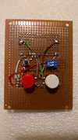

<meta http-equiv="Content-Type" content="text/html; charset=UTF-8"/>

# FrescoGO!

*FrescoGO!* é um marcador eletrônico semi-automático para jogos de Frescobol.

O aparelho marcador contém dois botões de marcação, um para o atleta à esquerda
(em vermelho) e um para o atleta à direita (em branco).
A marcação é feita por um juiz, que pressiona o botão correspondente ao atleta
toda vez que ele acerta a bola.
Golpes de esquerda e direita são distinguidos pelo tempo de pressionamento do
botão.
Com base em uma distância previamente estabelecida e o tempo decorrido entre
dois toques, o aparelho calcula a velocidade atingida pela bola em cada
momento.
O botão preto sinaliza início de sequência, queda de bola, fim de jogo, etc.

**O projeto eletrônico, o software e a regra são de domínio público, podendo
ser usados, copiados e modificados livremente.**

## Pontuação

Existem quatro quesitos que afetam a pontuação do jogo:

- Volume:
    - A velocidade de cada golpe efetuado por um atleta é elevada ao quadrado,
      dividida por 100 e somada ao total do atleta.
        - Ex., uma bola a 50km/h vale **25 pontos**:
          `50x50=2500 => 2500/100=25`.
- Potência:
    - Cada um dos 10 golpes mais velozes de direita e de esquerda de cada
      atleta são elevados ao quadrado (e divididos por 100), multiplicados por
      4 e somados ao total do atleta.
        - Ex., se um dos 10 melhores golpes de esquerda do atleta foi a 50km/h,
          ele vai somar mais **100 pontos** por aquele golpe (`25x4=100`).
- Equilíbrio:
    - A menor pontuação dentre os dois atletas será considerada como a
      pontuação da dupla. Mais precisamente, será o menor valor entre a média
      dos dois e 110% do que pontuou menos:
        - `MIN( (A1+A2)/2, MIN(A1,A2)x1.1 )`
        - Ex., se os atletas pontuaram 4000 e 5000 pontos, pega-se a média
          (`(5000+4000)/2 = 4500`) e 110% do menor (`4000x110% = 4400`).
          A pontuação de equilíbrio será o menor entre os dois valores: **4400
          pontos**.
- Continuidade:
    - Cada queda diminui 4% na pontuação final da dupla (ex., com 25 quedas a
      dupla perderá todos os pontos).
        - Ex., com 5 quedas e 4400 pontos após o equilíbrio, a pontuação final
          será de **3520 pontos** (`4400x80%`).

## Funcionamento

Configuração sugerida:

- Tempo: 180s cronometrados (3 minutos)
- Distância: 750cm (7.5m)

Fluxo do jogo:

- Um som agudo indica que o atleta pode sacar.
- Após o saque, o juiz pressiona o botão correspondente a cada atleta toda vez
  que ele acerta a bola. O tempo só passa quando há pressionamento do botão.
- Um som identifica a faixa de velocidade do golpe anterior:
    - ` < 40km/h`: som simples grave
    - ` < 50km/h`: som simples médio
    - ` < 60km/h`: som simples agudo
    - ` < 70km/h`: som duplo   grave
    - ` < 80km/h`: som duplo   médio
    - ` < 90km/h`: som duplo   agudo
    - `>= 90km/h`: som simples muito agudo
- Golpes do lado não preferencial do atleta acompanham um som grave após o som
  correspondente à velocidade.
- Quando o jogo está desequilibrado, os ataques do atleta que mais pontuou são
  acompanhados de um som grave.
- Quando a bola cai, o juiz pressiona o botão de queda que emite um som
  característico.
- Os dois últimos golpes são ignorados e o tempo volta ao momento do último
  golpe considerado.
- O juiz pressiona o botão de reinício e o fluxo reinicia.
- Um som agudo é emitido quando faltam 90s, 60s, 30s, 10s, e 5s para o jogo
  terminar.
- Ao fim do jogo é gerado um relatório com todas as medições dos golpes.

## Perguntas e Respostas

- Esse aparelho é um radar? Como o aparelho mede a velocidade da bola?
    - O aparelho não é um radar e mede a velocidade de maneira aproximada:
        - Os atletas devem estar a uma distância fixa predeterminada.
        - O juiz deve pressionar o botão no momento exato dos golpes (ou o mais
          próximo possível).
        - O aparelho divide a distância pelo tempo entre dois golpes
          consecutivos para calcular a velocidade.
        - Exemplo: se os atletas estão a 8 metros de distância e em um momento
          a bola leva 1 segundo para se deslocar entre os dois, então a
          velocidade foi de 8m/s (29km/h).

- Quais as desvantagens em relação ao radar?
    - A principal desvantagem é que a medição não é 100% precisa pois os
      atletas se movimentam e o juiz inevitavelmente irá atrasar ou adiantar as
      medições.
    - OBS:
      O radar também não é perfeito (erro de +1/-2 km/h) e qualquer angulação
      entre a trajetória da bola e a posição do radar afeta negativamente as
      medições (ex., um ângulo de 25 graus diminui as medições em 10%).
      (Fonte: <https://www.stalkerradar.com/stalker-speed-sensor/faq/stalker-speed-sensor-FAQ.shtml>)

- Por quê as velocidades são elevadas ao quadrado?
    - Para bonificar os golpes mais potentes.
      Quanto maior a velocidade, maior ainda será o quadrado dela.
      Uma bola a 50km/h vale `50x50=2500`, uma a 70km/h vale `70x70=4900`,
      praticamente o dobro (25 vs 49 pontos após a divisão por 100).

- Tem como o juiz "roubar"?
    - Ao atrasar a marcação de um golpe "A", consequentemente o golpe "B"
      seguinte será adiantado.
      O golpe "A" terá a velocidade reduzida e o golpe "B" terá a velocidade
      aumentada.
      Como a regra usa o quadrado das velocidades, esse atraso e adiantamento
      (se for sistemático) podem afetar a pontuação final.

- Tem como o atleta "roubar" ou "tirar vantagem" da regra?
    - O atleta pode projetar o corpo para frente e adiantar ao máximo os golpes
      para aumentar a medição das velocidades.

- Tem alguma vantagem em relação ao radar?
    - **Custo**:
        Os componentes do aparelho somados custam menos de R$100.
        O radar custa em torno de US$1000 (nos EUA) e não inclui o software
        para frescobol.
    - **Licença de uso**:
        Além do custo ser menor, não há nenhuma restrição legal sobre o uso
        do aparelho, software ou regra.
    - **Infraestrutura**:
        Além do aparelho, é necessário apenas um celular com um software
        gratuito (para obter as informações do jogo) e uma caixa de som
        potente (de preferência com bateria interna).
        Não é necessário computador, ponto de luz elétrica, área protegida ou
        outros ajustes finos para medição do jogo.
    - **Transparência das medições**:
        Apesar de serem menos precisas, as medições são transparentes e
        qualquer erro pode ser notado imediatamente.
        Todos os golpes acompanham um feedback sonoro imediato, mesmo as bolas
        abaixo de 40km/h.
        O radar só mede bolas acima de 40km/h e não é possível identificar se
        as medições estão sempre corretas (o posicionamento dos atletas, vento
        e outros fatores externos podem afetar as medições).
    - **Verificabilidade das medições**:
        Os atletas podem verificar se a pontuação final foi justa.
        Um acompanhante pode medir o jogo usando o mesmo aparelho durante a
        apresentação ou o jogo pode ser gravado e medido pelo vídeo após o
        evento.
