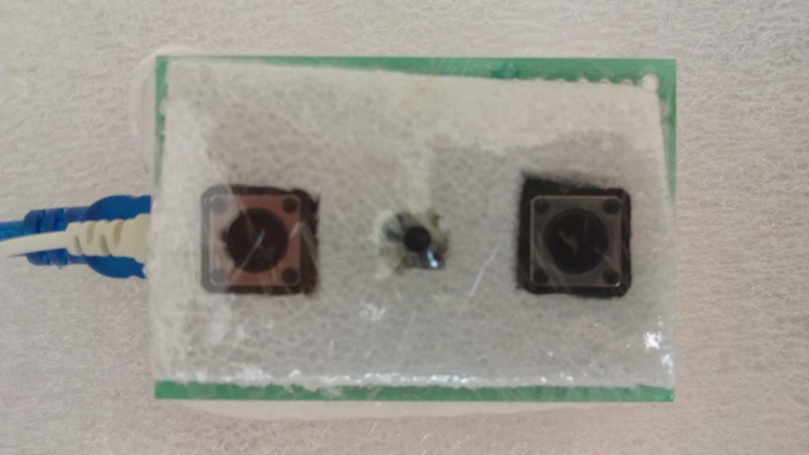
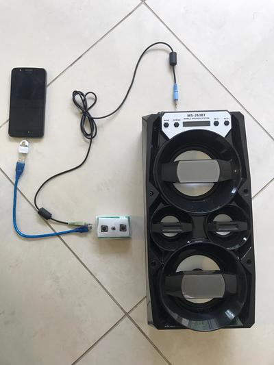

<meta http-equiv="Content-Type" content="text/html; charset=UTF-8"/>

# FrescoGO! (versão 1.3)

*FrescoGO!* é um marcador eletrônico semi-automático para competições de
Frescobol.

O aparelho marcador contém dois botões de marcação: um para o atleta à esquerda
e um para o atleta à direita.
A marcação é feita por um juiz, que pressiona o botão correspondente ao atleta
toda vez que ele acerta a bola.
<!--
Golpes de esquerda e direita são distinguidos pelo tempo de pressionamento do
botão.
-->
Com base em uma distância previamente estabelecida e o tempo decorrido entre
dois golpes consecutivos, o aparelho calcula a velocidade atingida pela bola a
cada momento.
O botão do meio sinaliza início de sequência, queda de bola, fim de
apresentação, etc.
Há uma entrada USB para alimentação e um saída para som.



- Links do projeto:
    - Site: <https://github.com/frescogo/frescogo>
    - E-mail: <go.frescobol@gmail.com>
    - Vídeo: <https://youtu.be/bAGGg3mtUSY>

**O projeto eletrônico, o software e a regra são de domínio público, podendo
ser usados, copiados e modificados livremente.**

-------------------------------------------------------------------------------

## Regra de Pontuação

Configuração sugerida:

- Tempo: 180s cronometrados (3 minutos)
- Distância: 750cm (7.5 metros)

Quesitos de pontuação:

- **Volume:**
    - A velocidade de cada golpe efetuado por um atleta é elevada ao quadrado,
      dividida por 100 e somada ao total do atleta. Não há velocidade mínima.
      Exemplos:
        - 30 kmh vale **9 pontos**:  `30x30/100 =  900/100 =  9`.
        - 40 kmh vale **16 pontos**: `40x40/100 = 1600/100 = 16`.
        - 50 kmh vale **25 pontos**: `50x50/100 = 2500/100 = 25`.
        - 60 kmh vale **36 pontos**: `60x60/100 = 3600/100 = 36`.
        - 70 kmh vale **49 pontos**: `70x70/100 = 4900/100 = 49`.
        - 80 kmh vale **64 pontos**: `80x80/100 = 6400/100 = 64`.
        - 90 kmh vale **81 pontos**: `90x90/100 = 8100/100 = 81`.
- **Potência:**
    - Cada um dos 7 golpes mais velozes de direita e de esquerda de cada
      atleta são contabilizados conforme a regra acima e ainda são
      multiplicados por 4 antes de serem somados ao total do atleta.
      Exemplo:
        - Se um desses golpes mais velozes foi a 50 kmh, o atleta vai somar
          mais **100 pontos** por aquele golpe (`25x4=100`), além dos 25 pontos
          já somados no quesito de volume.
    - OBS: Em uma apresentação de 3 minutos, 7 golpes correspondem a
      aproximadamente 10% dos golpes em posição de ataque.
- **Equilíbrio:**
    - A pontuação da dupla será a média de pontos entre os dois atletas.
    - Se o atleta que pontou menos estiver abaixo de 90% dessa média, então a
      pontuação da dupla será o menor valor.
    - Mais precisamente, a pontuação será o menor valor entre a média dos dois
      e 110% do que pontuou menos:
        - `MIN( (A1+A2)/2, MIN(A1,A2)x1.1 )`
        - Ex., se os atletas pontuaram 4000 e 5000 pontos, pega-se a média
          (`(5000+4000)/2 = 4500`) e 110% do menor (`4000x110% = 4400`).
          A pontuação de equilíbrio será o menor entre os dois valores
          (`4500 vs 4400`): **4400 pontos**.
- **Continuidade:**
    - Cada queda subtrai 4% da pontuação final da dupla.
      Exemplos:
        - Com 25 quedas, a dupla perderá todos os pontos (`25x4% = 100%`).
        - Com 5 quedas e 4400 pontos após o equilíbrio, a pontuação final
          será de **3520 pontos** (`4400x80%`).
    - A apresentação é encerrada sumariamente na 25a queda.

-------------------------------------------------------------------------------

## Fluxo da Apresentação

- Um som agudo longo indica que a uma nova apresentação irá começar.
- Um som agudo indica que o atleta pode sacar.
- Após o saque, o juiz pressiona o botão correspondente a cada atleta toda vez
  que ele acerta a bola. O tempo só passa quando o botão é pressionado.
- Um som identifica a faixa de velocidade do golpe anterior:
    - ` < 40 kmh`: som simples grave
    - ` < 50 kmh`: som simples médio
    - ` < 60 kmh`: som simples agudo
    - ` < 70 kmh`: som duplo   grave
    - ` < 80 kmh`: som duplo   médio
    - ` < 90 kmh`: som duplo   agudo
    - `>= 90 kmh`: som duplo   muito agudo
- Um golpe do lado não preferencial do atleta acompanha um som grave (após o
  som correspondente à velocidade).
- Quando a apresentação está desequilibrada, os ataques do atleta que mais
  pontuou acompanham um som grave.
- Quando a bola cai, o juiz pressiona o botão de queda que emite um som
  característico.
- Os dois últimos golpes são ignorados e o tempo volta ao momento do último
  golpe considerado (i.e., um ataque tem que ser defendido e depois confirmado
  pelo próprio atacante).
- O juiz então pressiona o botão que habilita o saque e o fluxo reinicia.
- Um som agudo é emitido a cada 1 minuto e também quando faltam 30, 10, e 5
  segundos para a apresentação terminar.
- A apresentação termina após 3 minutos cronometrados ou após a 25a queda.
  Um som grave longo indica que a apresentação terminou.
- Ao fim da apresentação, é gerado um relatório com todas as medições de
  golpes.

### Formatação do Resultado

A seguir são explicados os formatos de exibição do resultado da apresentação.

- Placar (a cada sequência)

```
--------------------------------
      João / Maria                      <-- nome dos atletas
    (750cm - 180s)                      <-- distância e tempo de apresentação
--------------------------------

     TOTAL: 904                         <-- total de pontos
     Tempo: 13290ms (-166s)             <-- tempo passado e restante
    Quedas: 1                           <-- número de quedas
    Golpes: 19                          <-- quantidade de golpes
     Ritmo: 45/47                       <-- ritmo em km/h (média simples/quadrática)
      Juiz: Arnaldo                     <-- nome do juiz

João: 1284                              <-- total do atleta à esquerda
 [  29  29  27  21   0   0   0 ] => 15  <-- 7 golpes de esquerda mais fortes => média simples
 [  77  75  75  61  44   0   0 ] => 47  <-- 7 golpes de direita  mais fortes => média simples

Maria: 856                              <-- total do atleta à direita
 [   0   0   0   0   0   0   0 ]        <-- 7 golpes de esquerda mais fortes
 [  67  55  54  49  38  34  33 ]        <-- 7 golpes de direita  mais fortes

(CONF: 750cm / 30s / pot=1 / equ=1 / cont=4)    <-- configurações
        \-- distância entre os ateltas
                \-- tempo de apresentação
                      \-- pontuação de potência ligada (0=desligada, 1=ligada)
                              \-- pontuação de equilíbrio ligada
                                      \-- percentual perdido por queda
```

- Relatório (ao final da apresentação)

```
-- Sequencia  1 ----------------        <-- Início da primeira sequência.
            ****                        <-- Maria efetuou o primeiro golpe.
     800            ( 33 / 1089)        <-- João golpeou 800ms depois.
             440    ( 61 / 3721)            A velocidade atingida foi de 33 kmh,
     820            ( 32 / 1024)            somando 1089 pontos para Maria
             350    ( 77 / 5929)            (10 pontos após a divisão por 100).
     790            ( 34 / 1156)
     ...
             930 !  ( 29 /  841)        <-- João golpeou de esquerda (!).
     550            ( 49 / 2401)        <-- Maria golpeou 550ms depois.
             610    ( 44 / 1936)            A velocidade atingida foi de 44 kmh,
     820            ( 32 / 1024)            somando 1936 pontos para João
             360    ( 75 / 5625)            (19 pontos após a divisão por 100).
     700            ( 38 / 1444)
             370
   -----   -----                        <-- Queda.
     256     195                        <-- Soma acumulada por João e por Maria
                                            (após a divisão por 100).
-- Sequencia XX ----------------        <-- Outras sequências...
...

--------------------------------        <-- Fim da apresentação.

Atleta    Vol     Esq     Dir   Total   <-- Volume e Potência (esq/dir)
  João:  5452 +   763 +  1723 =  7939   <-- Pontuação de João
 Maria:  6020 +   760 +  1943 =  8724   <-- Pontuação de Maria

Média:       8332                       <-- Média entre os dois
Equilibrio:     0 (-)                   <-- Desconto de equilíbrio
Quedas:      1667 (-)                   <-- Desconto de quedas
FINAL:       6665                       <-- Pontuação final da dupla
```

-------------------------------------------------------------------------------

## Instruções para o Juiz

### Ligação dos Cabos

- Celular (micro USB) -> Aparelho (mini USB)
    - É necessário um adaptador micro USB para USB
- Aparelho (PS2/AUX) -> Som (PS2/AUX)



### Aparelho marcador:

- Nova apresentação:
    - Pressione o botão do meio e em seguida o da direita por 5 segundos.
    - Resposta: um som médio de dois segundos.
- Início de sequência:
    - Pressione o botão do meio por um segundo, até escutar um som.
    - Resposta: um som agudo de meio segundo.
- Golpes dos atletas:
    - Pressione o botão da esquerda ou direita quando, respectivamente, o
      atleta à esquerda ou à direita golpearem a bola. Se o golpe for um
      backhand (ou o lado não preferencial do atleta), o pressionamento deve
      ser um pouco mais demorado.
    - Resposta: depende da velocidade (ver a seção "Fluxo da Apresentação").
- Queda de bola:
    - Pressione o botão do meio por um segundo, até escutar um som.
    - Resposta: três sons cada vez mais graves por meio segundo.
- Fim da apresentação:
    - Automático, quando o tempo do cronômetro expirar ou após a 25a queda.
    - Resposta: um som grave por dois segundos.
- Desfazer última sequência:
    - Pressione o botão do meio e em seguida o da esquerda por 5 segundos.
    - Resposta: três sons cada vez mais agudos por meio segundo.
- Reconfiguração de fábrica:
    - Pressione o botão do meio e em seguida os da esquerda e direita por
      5 segundos.
    - Resposta: um som médio de dois segundos.
    - **Em princípio, esse procedimento nunca deverá ser necessário.**

### Aplicativo Android

- Instalação (apenas uma vez):
    - Instalar o app "Serial USB Terminal" (by Kai Morich).
- Configuração (apenas uma vez):
    - Tocar nas três barras paralelas no canto superior esquerdo e selecionar
      "Settings".
    - Trocar "Baud rate" para `9600`.
    - Desabilitar "Show timestamps".
    - Trocar "Buffer size" para `50 kB`.
    - Habilitar "Keep screen on when connected".
- Conexão (sempre que abrir o aplicativo):
    - Conectar o aparelho ao celular via cabo USB.
    - Tocar no ícone com dois cabos desconectados no centro superior direito da
      tela.
        - O ícone deve mudar para um com cabos conectados.
        - A área central do app deve exibir "Connected to..." e o placar da
          última apresentação.

<!--
    - O placar da última apresentação deve ser exibido no centro da tela.
    - A cada queda e reinício, é exibido o placar da apresentação em andamento.
-->

- Comandos (durante as apresentações):
    - Digitar o comando completo na área de texto na base inferior e em seguida
      tocar no ícone com uma seta no canto inferior direito.
    - Exibição:
        - `placar`
            - exibe o placar da apresentação
        - `relatorio`
            - exibe o relatório completo da apresentação
    - Ação:
        - `reiniciar`
            - reinicia a apresentação imediatamente
        - `terminar`
            - termina a apresentação imediatamente
        - `desfazer`
            - desconsidera por inteiro a sequência anterior
        - `restaurar`
            - restaura configuração de fábrica
    - Configuração:
        - `tempo SEGS`
            - altera o tempo total das apresentações para `SEGS`, que deve ser
              um número em segundos
        - `distancia CMS`
            - altera a distância das apresentações para `CMS`, que deve ser um
              número em centímetros
        - `potencia NUM`
            - liga ou desliga a pontuação de potência (`0=desligada`, `1=ligada`)
        - `equilibrio NUM`
            - liga ou desliga a pontuação de equlíbrio (`0=desligada`, `1=ligada`)
        - `continuidade PCT`
            - altera o percentual de perda por queda de bola para `PCT`
        - `esquerda NOME`
            - altera o nome do atleta à esquerda para `NOME`, que deve ter até
              15 caracteres
        - `direita NOME`
            - altera o nome do atleta à direita para `NOME`, que deve ter até
              15 caracteres
        - `juiz NOME`
            - altera o nome do juiz para `NOME`, que deve ter até 15 caracteres


-------------------------------------------------------------------------------

## Perguntas e Respostas

- Esse aparelho é um radar? Como o aparelho mede a velocidade da bola?
    - O aparelho não é um radar e mede a velocidade de maneira aproximada:
        - Os atletas devem estar a uma distância fixa predeterminada.
        - O juiz deve pressionar o botão no momento exato dos golpes (ou o mais
          próximo possível).
        - O aparelho divide a distância pelo tempo entre dois golpes
          consecutivos para calcular a velocidade.
        - Exemplo: se os atletas estão a 8 metros de distância e em um momento
          a bola leva 1 segundo para se deslocar entre os dois, então a
          velocidade foi de 8m/s (29 kmh).

- Quais as desvantagens em relação ao radar?
    - A principal desvantagem é que a medição não é tão precisa pois os atletas
      se movimentam e o juiz inevitavelmente irá atrasar ou adiantar as
      medições.
    - OBS:
      O radar também não é perfeito, tendo erro estimado entre +1/-2 kmh.
      Além disso, qualquer angulação entre a trajetória da bola e a posição do
      radar afeta negativamente as medições (ex., um ângulo de 25 graus diminui
      as medições em 10%).
        - Fonte: <https://www.stalkerradar.com/stalker-speed-sensor/faq/stalker-speed-sensor-FAQ.shtml>

- Por quê as velocidades são elevadas ao quadrado?
    - Para bonificar os golpes mais potentes.
      Quanto maior a velocidade, maior ainda será o quadrado dela.
      Uma bola a 50 kmh vale `50x50=2500`, uma a 70 kmh vale `70x70=4900`,
      praticamente o dobro (25 vs 49 pontos, após a divisão por 100).

- Tem como o juiz "roubar"?
    - Ao atrasar a marcação de um golpe "A", consequentemente o golpe "B"
      seguinte será adiantado.
      O golpe "A" terá a velocidade reduzida e o golpe "B" terá a velocidade
      aumentada.
      Como a regra usa o quadrado das velocidades, esse atraso e adiantamento
      (se forem sistemáticos) podem afetar a pontuação final.

- Tem como o atleta "roubar" ou "tirar vantagem" da regra?
    - O atleta pode projetar o corpo para frente e adiantar ao máximo os golpes
      para aumentar a medição das velocidades.

- Tem alguma vantagem em relação ao radar?
    - **Custo**:
        Os componentes do aparelho somados custam menos de R$50.
        O radar custa em torno de US$1000 e não inclui o software para
        frescobol.
    - **Licença de uso**:
        Além do custo ser menor, não há nenhuma restrição legal sobre o uso
        do aparelho, software ou regra.
    - **Infraestrutura**:
        Além do aparelho, é necessário apenas um celular com um software
        gratuito (para obter o placar das apresentações) e uma caixa de som
        potente (de preferência com bateria interna).
        Não é necessário computador, ponto de luz elétrica, área protegida ou
        outros ajustes finos para a medição da apresentação.
        Essa simplicidade permite que múltiplas arenas funcionem ao mesmo
        tempo.
    - **Transparência das medições**:
        Apesar de serem menos precisas, as medições são audíveis e qualquer
        erro grosseiro pode ser notado imediatamente.
        O radar só mede bolas acima de 40 kmh e não é possível identificar se
        as medições estão sempre corretas (o posicionamento dos atletas, vento
        e outros fatores externos podem afetar as medições).
    - **Verificabilidade das medições**:
        Os atletas podem verificar se a pontuação final foi justa.
        As apresentações podem ser medidas por um aparelho igual durante as
        apresentaçõs ou podem ser gravados para medição posterior pelo vídeo.
