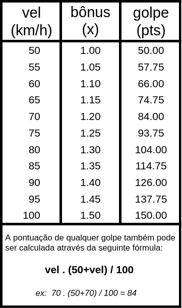

<meta http-equiv="Content-Type" content="text/html; charset=UTF-8"/>

# FrescoGO! (v5)

O *FrescoGO!* é um software para avaliação de apresentações de Frescobol
competitivo.
A avaliação é baseada na velocidade que a bolinha atinge a cada golpe dos
atletas.
O *FrescoGO!* oferece dois modos de aferição das velocidades:
- Automático com um radar Doppler que mede as velocidades de pico da bolinha
  continuamente.
- Manual com teclas que medem o intervalo de tempo entre dois golpes
  consecutivos para inferir as velocidades considerando uma distância
  predeterminada entre os atletas.

Links do projeto:
- Site: <https://github.com/frescogo/frescogo>
- E-mail: <go.frescobol@gmail.com>
- Licença: <https://creativecommons.org/publicdomain/mark/1.0/deed.pt_BR>

**O software e a regra do FrescoGO! são de domínio público, podendo ser usados,
  copiados e modificados livremente.**

## Regra

<!--

-->

<p>

</p>

- Tempo:
    - 5 minutos cronometrados.
- Golpes:
    - Cada golpe pontua de acordo com a tabela ao lado.
    - São considerados somente os 150 golpes mais fortes de cada atleta.
- Ataques:
    - Os 25 ataques mais fortes de cada lado são pontuados em dobro.
    - Um ataque precisa ser 20% mais forte que o golpe anterior.
- Equilíbrio:
    - A diferença de pontuação entre os atletas fica limitada a até 30%.
        - (ex, se um atleta pontua 10000, o outro fica limitado a até 13000)
- Quedas:
    - As primeiras 5 quedas não descontam pontos.
    - A partir da 6ᵃ queda, cada queda desconta 3% da pontuação final.
        - (ex, um jogo que termina com 10 quedas tem 15% de penalização)
    - A 20ᵃ queda interrompe o jogo sumariamente.

<!--
- Cada atleta é avaliado em separado com uma pontuação:
    - `ATL = Ata x Vel`
        - `ATL` é a pontuação do atleta a ser calculada.
        - `Ata` é a quantidade de ataques.
        - `Vel` é a média de velocidade dos golpes.
    - São validados somente os `100` ataques mais fortes acima de `50` km/h.
- Cada queda desconta `2%` da pontuação da dupla:
    - `TOTAL = (ATL1 + ATL2) - (2% por queda)`
    - A apresentação é encerrada sumariamente ao atingir `16` quedas.
- Em caso de empate entre duplas, os seguintes quesitos serão usados para
  desempate:
    (1) maior quantidade de golpes,
    (2) menor quantidade de quedas,
    (3) sorteio.
- Resumo:
```
    ATL1  = Ata x Vel
    ATL2  = Ata x Vel
    TOTAL = (ATL1 + ATL2) - (2% por queda)
```
-->

## Agradecimentos

Agradecemos a todos os que contribuíram para o desenvolvimento do FrescoGO!:

- Adão (RJ)
- Alessandra (BA)
- Antônio (RJ)
- Clebinho (RN)
- Dão (RJ)
- Elton (RJ)
- Fátima (RJ)
- Lúcia (RJ)
- Luciano Paredão (RN)
- Luiz Negão (RJ)
- Mateus (RJ)
- PH (RJ)
- Wal (RJ)
